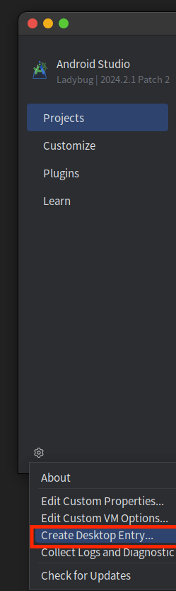

## 修复[ASFP](https://developer.android.com/studio/platform)在Ubuntu的程序坞的程序图标,跟Android Studio程序图标的启动标记混淆,和配置了frameworks/base/core, frameworks/base/services会生成platformprotoslite相关jar包导致部分android库的源码引导混乱

### 使用方式

#### 下载或者源码编译后的 asfp_java_agent.jar ,启动ASFP后在菜单栏 Help | Edit Custom Properties 配置 javaagent

```
-javaagent:存放目录的绝对路径/asfp_java_agent.jar
```

#### 基于源码进行编译
编译后的jar包在build/libs/asfp_java_agent.jar
```shell
git clone https://github.com/ShikinChen/asfp_java_agent.git
cd asfp_java_agent
./gradlew jar
```
### 程序图标创建和说明
默认使用ASFP创建程序图标<br/>

<br/>

程序图标在~/.local/share/applications/studio-asfp.desktop<br/>

下面是studio-asfp.desktop的内容,Ubuntu是根据StartupWMClass查找对应的程序图标,但是ASFP是基于Android
Studio修改出来所以默认还是保留Android Studio相关信息

```
[Desktop Entry]
Version=1.0
Type=Application
Name=Android Studio
Icon=/opt/android-studio-for-platform/bin/studio.svg
Exec="/opt/android-studio-for-platform/bin/studio" %f
Comment=The Drive to Develop
Categories=Development;IDE;
Terminal=false
StartupWMClass=studio-asfp
StartupNotify=true
```

### 配置了frameworks/base/core, frameworks/base/services会生成platformprotoslite相关jar包导致部分android库的源码引导混乱原因

在/opt/android-studio-for-platform/plugins/asfp/lib/asfp.jar的
com/android/tools/asfp/soong/BuildArtifactMergedModuleInfo.class从而根据out/soong/module_bp_java_deps.json进行源码依赖索引配置<br/>
本来打算通过asm修改里面的静态常量EXCLUDED_MODULES增加过滤模块,从忽略不需要的模块,但是我估计因为常量是放方法区改变set的长度导致有位移而报错,就修改JdepsKt的parseJdeps返参map,删除多余的模块<br/><br/>
BuildArtifactMergedModuleInfo.class关键代码

```java
var145 = androidBuildTop.resolve("out/soong/module_bp_java_deps.json");
Intrinsics.checkNotNullExpressionValue(var145, "resolve(...)");
Map $this$filterNot$iv = JdepsKt.parseJdeps(var145);
int $i$f$filterNot = false;
Map destination$iv$iv = (Map)(new LinkedHashMap());
int shouldExcludeAllFull = false;
Iterator var84 = $this$filterNot$iv.entrySet().iterator();

boolean var96;
while(var84.hasNext()) {
    element$iv$iv = (Map.Entry)var84.next();
    var96 = false;
    if (!EXCLUDED_MODULES.contains(element$iv$iv.getKey())) {
            destination$iv$iv.put(element$iv$iv.getKey(), element$iv$iv.getValue());
    }
}
    
```


